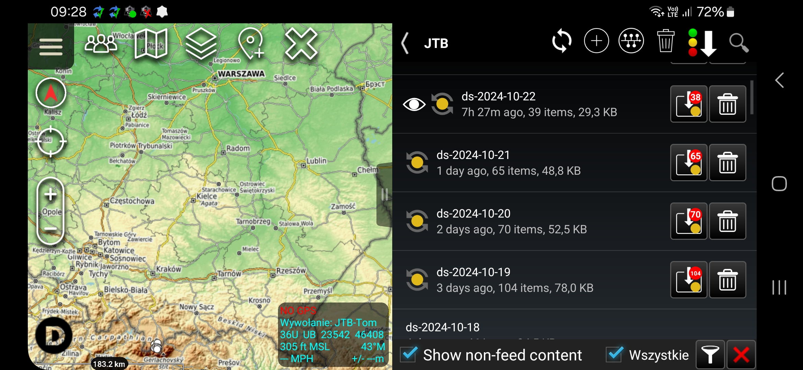

# DSArchive

## Description

This TAK server plugin automatically adds CoTs to Data Sync feeds.

It doesn't require the client to have the Data Sync plugin.

It has three types of operation:

### Daily feed
In this mode, the plugin adds all CoTs to a daily created feed.

The daily feed name will be set to: ds-YYYY-MM-dd, ie. ds-2024-10-15

To enable that functionality, create a feed named "ds-daily"

### Group feed
In this mode, the plugin adds all CoTs for a specific group to the group feed.

To enable that functionality, create a feed named "ds-*groupName*", ie. "ds-team1"

### Group daily feed
In this mode, the plugin adds all CoTs to a daily created, group specigic feed.

The daily group feed name will be set to: ds-*groupName*-YYYY-MM-dd, ie. ds-team1-2024-10-15

To enable that functionality, create a feed named "ds-*groupName*-daily"
