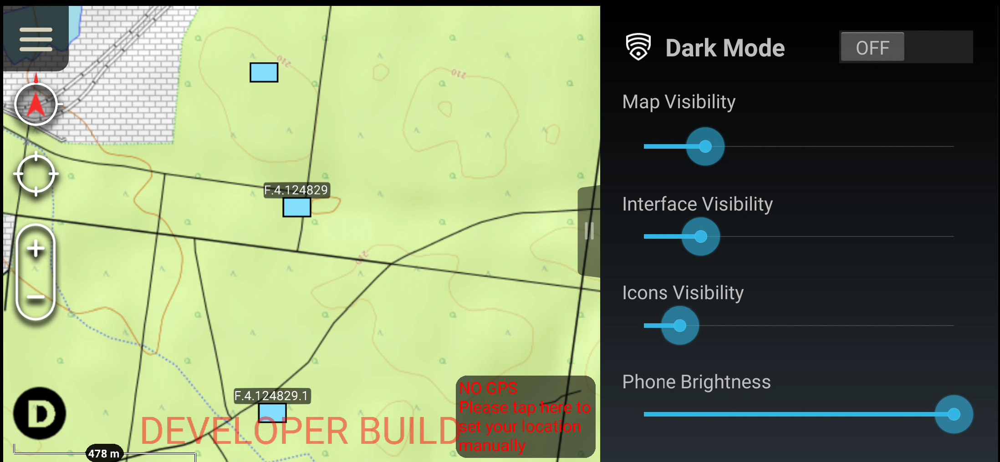

# DarkMode

## Description
Dark Mode plugin provides an easy way for ATAK to be used at night. It allows configurable dimming of ATAK and the phone screen on touch of a button.

## Features
- Ability to apply different brightness to the interface and the map
- Ability to control the phone brightness
- Icon that allows toggling the Dark Mode from the map view (bottom left corner)
- Ability to toggle the Dark Mode using the volume buttons (press up/down or down/up - need to disable rotating maps using volume buttons in the settings)
  
