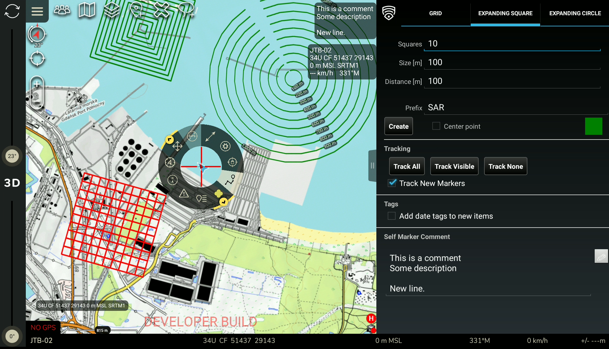

# SARToolkit

## Description
SARToolkit is an ATAK plugin that adds various features / configuration options (more or less related or useful in Search and Rescue operations).

## Features
- Ability to create a search grid or concentric squares/circles made of individual objects
- Ability to create an alert from an existing marker
- Ability to automatically enable tracking for all team members
- Ability to automatically enable tracking for all visible objects
- Ability to set user custom comment to the self marker
- Ability to automatically add tags with current date to new items
