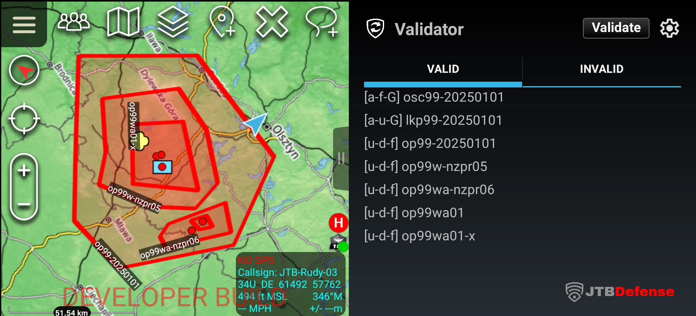

# Validator

## Description
The Validator plugin verifies naming standards for various CoT types using preconfigured regex rules.

## Notes
- You can add multiple regex entries for the same CoT type, if any of them will match, name will be considered valid. 
- You can use wildcards in CoT type (ie. a-f-*)

## Examples
a-u-g=(?i)lkp\d{2}-\d{8}
a-f-g=(?i)osc\d{2}-\d{8}
a-f-g=(?i)kdp\d{2}-\d{8}
u-d-*=(?i)op\d{2}[a-z]{1,2}\d{2}-[a-z]
u-d-*=(?i)op\d{2}-\d{8}
u-d-*=(?i)op\d{2}[a-z]{2}\d{2}
u-d-*=(?i)op\d{2}[a-z]{1,2}-[a-z0-9]{5,6}
    

**Preferences key for regex configuration:**  
com.jtbdefense.atak.NamingValidator.preferences.REGEX_DATA